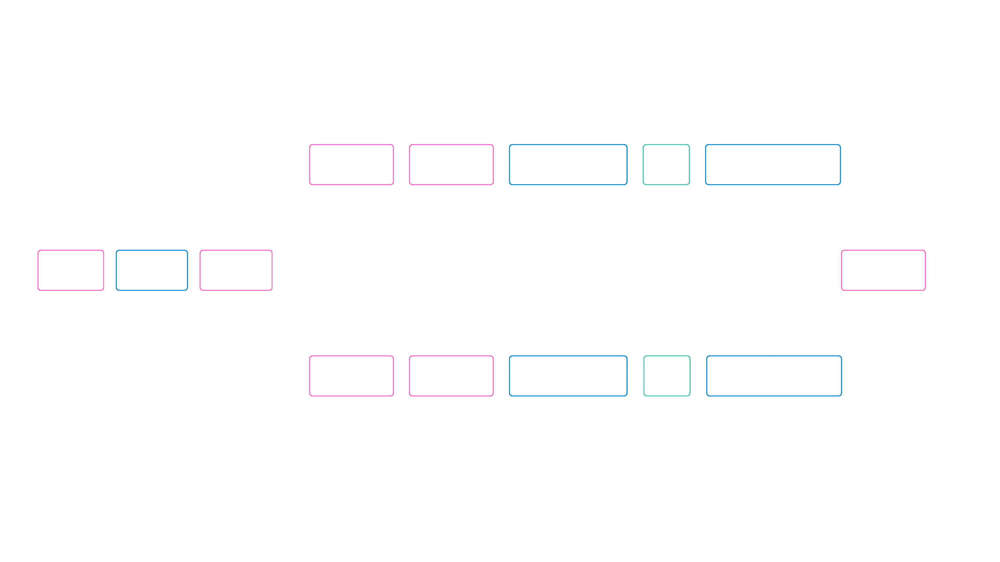

# 🔍 YOLOv11 Image Search Engine

A Streamlit web app that runs **YOLOv11** object detection across a batch of images, then lets you **search and filter your image library by detected object class** — with count thresholds, AND/OR logic, bounding-box visualization, and JSON export.

Think of it as a mini "reverse image search" over your own photo/dataset folder: upload a batch of images once, and instantly query "show me every image with 2+ dogs and no cats."



---

## ✨ Features

- **Batch object detection** — Run YOLOv11 inference over an uploaded ZIP/image batch or any local directory, and persist results as reusable `metadata.json`.
- **Class-based search engine** — Filter processed images by one or more detected classes with:
  - **OR mode** (any selected class present) or **AND mode** (all selected classes present)
  - Optional **max-count thresholds** per class (e.g. "at most 3 people")
- **Visual results grid** — Adjustable-column image grid with live bounding-box overlays and confidence scores, highlighting only the matched classes.
- **Reload without re-running inference** — Load a previously saved `metadata.json` to search instantly, without re-processing images.
- **Export** — Download search results as JSON for downstream use.
- **CPU & GPU ready** — Separate setup paths for CPU-only and CUDA-accelerated (PyTorch + `pytorch-cuda`) environments.

---

## 🏗️ Tech Stack

| Layer | Technology |
|---|---|
| Object Detection | [Ultralytics YOLOv11](https://docs.ultralytics.com/) |
| Deep Learning Backend | PyTorch, TorchVision |
| Web UI | Streamlit |
| Image Processing | Pillow, OpenCV (headless) |
| Config Management | PyYAML |
| Data Handling | NumPy, Pandas |
| Language | Python 3.11 |

---

## 📁 Project Structure

```
Yolo_search_image/
├── app.py                  # Streamlit application (UI + search engine logic)
├── src/
│   ├── inference.py         # YOLOv11Inference: runs detection on images/directories
│   ├── utils.py              # Metadata save/load, unique class + count aggregation
│   └── config.py              # Path setup & YAML config loader
├── configs/
│   └── default.yaml         # Model name, confidence threshold, image extensions
├── data/
│   ├── raw/                  # Uploaded / source images
│   └── processed/            # Generated metadata.json per dataset
├── test/
│   └── streamlit_basics.py  # Streamlit experimentation scratchpad
├── instruction.txt          # Environment setup notes (conda, CUDA)
└── requirements.txt
```

---

## ⚙️ Setup

### CPU

```bash
conda create -n yolo_image_search python=3.11 -y
conda activate yolo_image_search
pip install -r requirements.txt
```

### GPU (CUDA)

```bash
conda create -n yolo_image_search_gpu python=3.11 -y
conda activate yolo_image_search_gpu
conda install pytorch==2.5.1 torchvision==0.20.1 pytorch-cuda=12.4 -c pytorch -c nvidia
pip install -r requirements.txt
```

> See NVIDIA's [Linux](https://docs.nvidia.com/cuda/cuda-installation-guide-linux/) or [Windows](https://docs.nvidia.com/cuda/cuda-installation-guide-microsoft-windows/) CUDA installation guides if you need GPU support.

---

## 🚀 Usage

```bash
streamlit run app.py
```

1. **Process new images** — Upload images/a ZIP (saved to `data/raw/<dataset_name>`) or point to a local directory, then run inference. Detections are saved to `data/processed/<dataset_name>/metadata.json`.
2. **Load existing metadata** — Re-load a previously generated `metadata.json` to skip re-running inference.
3. **Search** — Pick one or more object classes, choose AND/OR mode, optionally cap per-class counts, and hit **Search Images**.
4. **Review & export** — Browse matching images in a grid with bounding boxes, toggle display options, and download results as JSON.

---

## 🔧 Configuration

Detection behavior is controlled via `configs/default.yaml`:

```yaml
model:
  yolo_model: "yolo11m.pt"
  conf_threshold: 0.3

data:
  image_extension: [".jpg", ".jpeg", ".png"]
```

---

## 🗺️ Roadmap / Ideas

- Persist search history and support saved search presets
- Add spatial/positional search (e.g. "object in top-left quadrant")
- Support video frame extraction + detection
- Dockerize for one-command deployment

---


